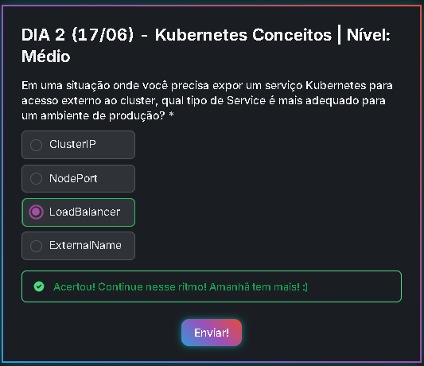

# Desafio 2:

## Questão sobre Kubernetes:

### Cluster IP:
Cria um endereço IP interno para o serviço, inacessível fora do cluster, sendo indicado para comunicação interna entre serviços.

### NodePort:
Expõe o serviço em porta estática em todos os nós do cluster.

### LoadBalancer:
O LoadBalancer distribui o tráfego entre os pods do serviço, garantindo alta disponibilidade e desempenho.

### ExternalName:
O serviço ExternalName faz referência a um endereço DNS externo em vez de apenas pods, o que permitirá que autores de aplicativos referenciem serviços que existem fora da plataforma, em outros clusters ou localmente.

